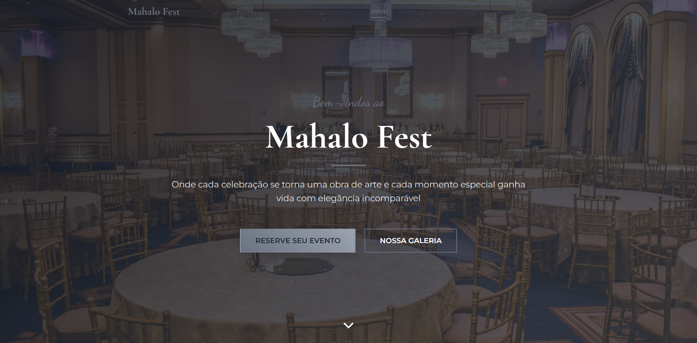

# Mahalo Fest

Landing page de um salão de festas premium, construída com HTML, CSS e JavaScript modulares.

## Sobre o projeto

Uma página única, responsiva e com animações suaves, feita para apresentar os serviços do salão (casamentos, aniversários, eventos corporativos, etc.) e captar contatos via formulário.

O foco principal foi montar uma **arquitetura de código limpa e escalável**, separando CSS e JS em módulos por responsabilidade.

## Stack

- **HTML5** semântico
- **CSS3** modular com BEM
- **JavaScript ES6+** com module pattern (IIFE)
- **AOS** para animações on scroll
- **Font Awesome** para ícones
- **Google Fonts** (Cormorant Garamond, Montserrat, Dancing Script)

## Seções da página

1. Navigation (com menu mobile)
2. Hero
3. Services
4. About
5. Gallery
6. Location
7. Testimonials
8. Contact (com formulário validado)
9. Footer

## Customização

As cores, fontes e espaçamentos ficam todos em [`assets/css/variables.css`](assets/css/variables.css). Para mudar a identidade visual, basta editar os tokens ali — todo o resto da página se adapta automaticamente.

Feito por Mathues campos.
